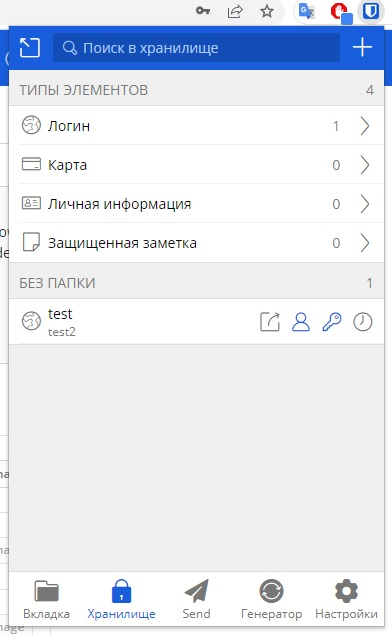
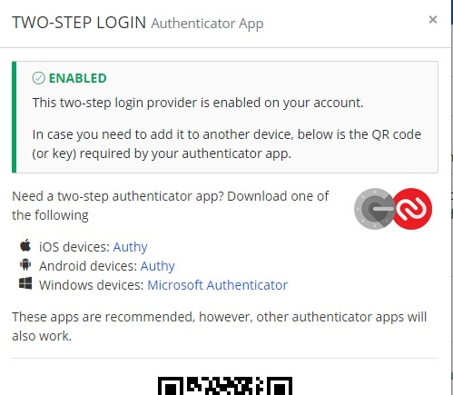
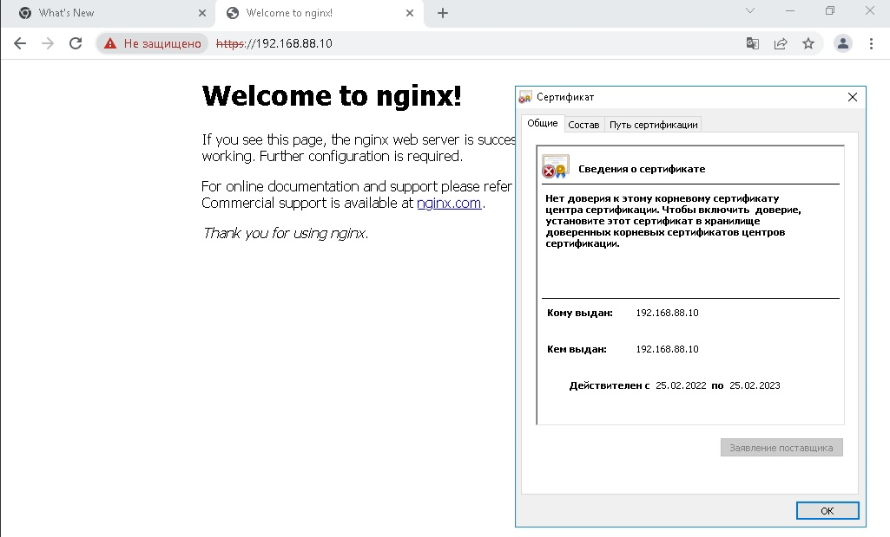
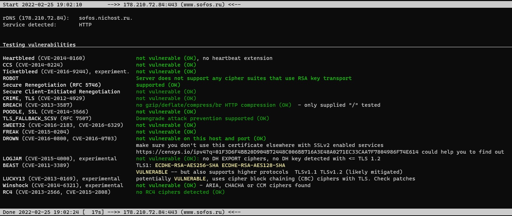

1. 
2. 
3. nginx
```server {
        listen 80 default_server;
        listen [::]:80 default_server;
        root /var/www/html;
        index index.html index.htm index.nginx-debian.html;
        server_name 192.168.88.10;
        return 302 https://$server_name$request_uri;
}
server {
# SSL configuration
        listen 443 ssl http2 default_server;
        listen [::]:443 ssl http2 default_server;
        include snippets/self-signed.conf;
        #include snippets/ssl-params.conf;
        root /var/www/html;
        index index.html index.htm index.nginx-debian.html;
        server_name 192.168.88.10;
}
```

4. 
5. 
```
vagrant@vagrant:~$ ssh user@79.120.xx.xx
Linux debian 5.10.0-11-amd64 #1 SMP Debian 5.10.92-1 (2022-01-18) x86_64

The programs included with the Debian GNU/Linux system are free software;
the exact distribution terms for each program are described in the
individual files in /usr/share/doc/*/copyright.

Debian GNU/Linux comes with ABSOLUTELY NO WARRANTY, to the extent
permitted by applicable law.
You have new mail.
Last login: Fri Feb 25 11:02:13 2022 from 
user@debian:~$ exit
```
6. 
```
vagrant@vagrant:~$ cat .ssh/config
Host debian
        HostName 79.120.XX.XX
        IdentityFile ~/.ssh/id_rsa2
        User user
        Port 1922
        ##StrictHostKeyChecking no
vagrant@vagrant:~$ ssh debian
Linux debian 5.10.0-11-amd64 #1 SMP Debian 5.10.92-1 (2022-01-18) x86_64

The programs included with the Debian GNU/Linux system are free software;
the exact distribution terms for each program are described in the
individual files in /usr/share/doc/*/copyright.

Debian GNU/Linux comes with ABSOLUTELY NO WARRANTY, to the extent
permitted by applicable law.
You have new mail.
Last login: Fri Feb 25 15:45:48 2022 from
```
7. 
```
@debian:~$ sudo tcpdump -c 100 -w 001.pcap -i enp6s0
```
