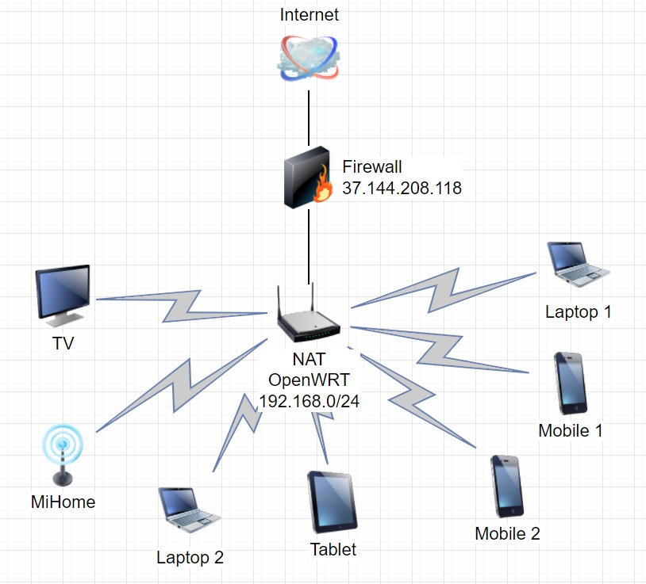

1. 
```
route-views>show ip route 79.120.12.68
Routing entry for 79.120.0.0/17
  Known via "bgp 6447", distance 20, metric 0
  Tag 3303, type external
  Last update from 217.192.89.50 1w3d ago
  Routing Descriptor Blocks:
  * 217.192.89.50, from 217.192.89.50, 1w3d ago
      Route metric is 0, traffic share count is 1
      AS Hops 2
      Route tag 3303
      MPLS label: none
route-views>show bgp 79.120.12.68
BGP routing table entry for 79.120.0.0/17, version 305317099
Paths: (23 available, best #14, table default)
  Not advertised to any peer
  Refresh Epoch 1
  8283 12714
    94.142.247.3 from 94.142.247.3 (94.142.247.3)
      Origin IGP, metric 0, localpref 100, valid, external
      Community: 8283:1 8283:101 12714:62000
      unknown transitive attribute: flag 0xE0 type 0x20 length 0x18
        value 0000 205B 0000 0000 0000 0001 0000 205B
              0000 0005 0000 0001
      path 7FE11602C360 RPKI State not found
      rx pathid: 0, tx pathid: 0
  Refresh Epoch 1
  1351 6939 12714
    132.198.255.253 from 132.198.255.253 (132.198.255.253)
      Origin IGP, localpref 100, valid, external
      path 7FE08DE5F478 RPKI State not found
      rx pathid: 0, tx pathid: 0
  Refresh Epoch 1
  57866 1299 12714
    37.139.139.17 from 37.139.139.17 (37.139.139.17)
      Origin IGP, metric 0, localpref 100, valid, external
      Community: 1299:30000 57866:100 57866:101 57866:501
      path 7FE0534C4178 RPKI State not found
      rx pathid: 0, tx pathid: 0
  Refresh Epoch 1
  3333 12714
    193.0.0.56 from 193.0.0.56 (193.0.0.56)
```  
2.
``` 
$ip link add dummy0 type dummy
$ip link set dummy0 up
$ip address add 10.10.10.10/24 dev dummy0
3: dummy0: <BROADCAST,NOARP,UP,LOWER_UP> mtu 1500 qdisc noqueue state UNKNOWN group default qlen 1000
    link/ether de:75:02:b6:86:61 brd ff:ff:ff:ff:ff:ff
    inet 10.10.10.10/24 scope global dummy0
       valid_lft forever preferred_lft forever
    inet6 fe80::dc75:2ff:feb6:8661/64 scope link
       valid_lft forever preferred_lft forever
$ ip route
default via 192.168.88.1 dev enp6s0 onlink
10.10.0.0/24 dev dummy0 scope link
10.10.1.0/24 dev dummy0 scope link
10.10.10.0/24 dev dummy0 proto kernel scope link src 10.10.10.10
192.168.88.0/24 dev enp6s0 proto kernel scope link src 192.168.88.10
```  
3.
```
ss -ltpn
State     Recv-Q    Send-Q       Local Address:Port          Peer Address:Port    Process
LISTEN    0         128                0.0.0.0:22                 0.0.0.0:*        users:(("sshd",pid=601,fd=3))
LISTEN    0         20               127.0.0.1:25                 0.0.0.0:*        users:(("exim4",pid=1113,fd=4))
LISTEN    0         4096             127.0.0.1:8125               0.0.0.0:*        users:(("netdata",pid=552,fd=85))
LISTEN    0         4096               0.0.0.0:19999              0.0.0.0:*        users:(("netdata",pid=552,fd=4))
LISTEN    0         128                   [::]:22                    [::]:*        users:(("sshd",pid=601,fd=4))
LISTEN    0         20                   [::1]:25                    [::]:*        users:(("exim4",pid=1113,fd=5))
LISTEN    0         4096                 [::1]:8125                  [::]:*        users:(("netdata",pid=552,fd=84))
```  
4. 
```
ss -lupn
State     Recv-Q    Send-Q        Local Address:Port         Peer Address:Port    Process
UNCONN    0         0                 127.0.0.1:8125              0.0.0.0:*        users:(("netdata",pid=552,fd=83))
UNCONN    0         0                     [::1]:8125                 [::]:*        users:(("netdata",pid=552,fd=67))
```
5. 