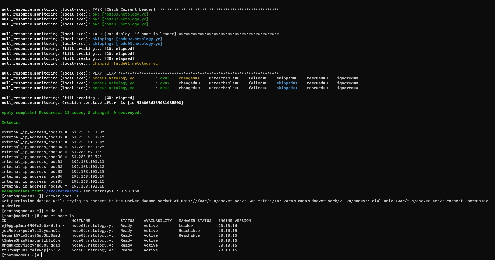
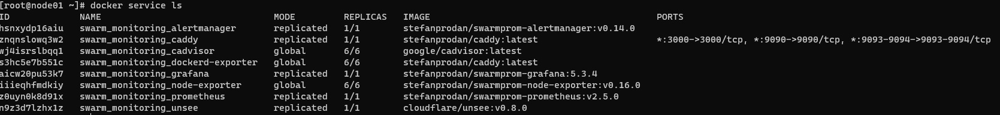

# Домашнее задание к занятию "5.5. Оркестрация кластером Docker контейнеров на примере Docker Swarm"


---

## Задача 1

Дайте письменые ответы на следующие вопросы:

- В чём отличие режимов работы сервисов в Docker Swarm кластере: replication и global?  
***mode: global сервис будет запущен только в одном экземпляре на всех нодах***  
***mode: replicated будет запущено указанное число контейнеров для сервиса на всех доступных нодах***
- Какой алгоритм выбора лидера используется в Docker Swarm кластере?  
***Raft - алгоритм поддержания распределенного консенсуса.***
- Что такое Overlay Network?  
***overlay-network виртуальная сеть использующая технологию vxlan и связывающая несколько хостов на котокрых запущен docker.***

## Задача 2

Создать ваш первый Docker Swarm кластер в Яндекс.Облаке

Для получения зачета, вам необходимо предоставить скриншот из терминала (консоли), с выводом команды:
```
docker node ls
```


## Задача 3

Создать ваш первый, готовый к боевой эксплуатации кластер мониторинга, состоящий из стека микросервисов.

Для получения зачета, вам необходимо предоставить скриншот из терминала (консоли), с выводом команды:
```
docker service ls
```
